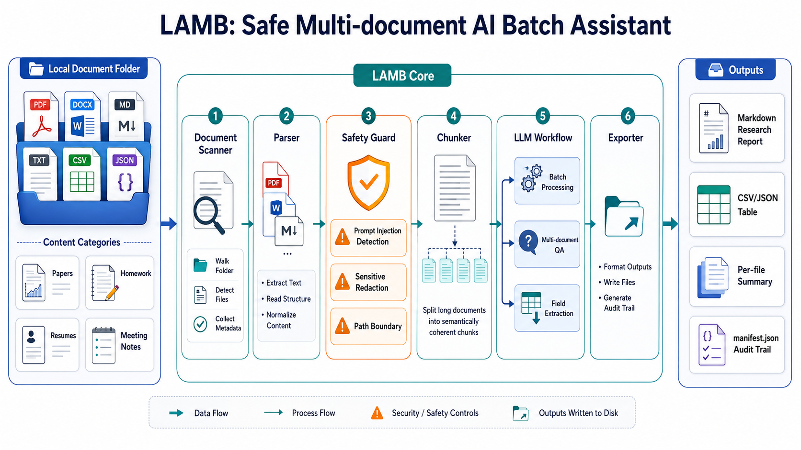

# LAMB

**One sentence in. A trusted file-batch automation workflow out.**

[](https://www.python.org/)
[](LICENSE)
[](#quick-demo)
[](docs/security-model.md)

Chinese version: [README.zh.md](README.zh.md)

> Give LAMB a folder and describe the goal in one sentence. It plans the workflow, asks for confirmation when the task is ambiguous, processes the whole folder with safety guards, exports results, and writes an audit manifest.

---

## Why LAMB

Most AI document tools work well for one file or one chat. Real work often starts with a folder: homework submissions, papers, meeting notes, resumes, reports, contracts, or mixed project materials.

| Pain | What usually happens | How LAMB helps |
| --- | --- | --- |
| Folder-level work | Files are uploaded and prompted one by one | Process an entire folder through one automation workflow |
| Unclear workflow design | Users must invent prompts, steps, and output formats | Turn a one-sentence goal into an executable plan |
| Different tasks need different flows | Summaries, tables, QA, and safety checks are mixed manually | Combine built-in presets with AI-tailored plan customization |
| Untrusted document content | Files may contain prompt injection, secrets, or risky instructions | Treat documents as untrusted evidence and run safety checks |
| Weak traceability | Outputs cannot be tied back to inputs, parameters, and failures | Write a manifest for every run |

LAMB is not a simple prompt wrapper. It is a small workflow engine for safe, auditable, folder-level file automation.

---

## Core Method

### One-Sentence File Automation

LAMB is designed around a simple interaction model: describe what you want, review the plan, then run it.

```text
folder + one-sentence goal
  -> preset workflow router
  -> optional AI-customized pipeline
  -> human confirmation checklist
  -> safety-aware execution
  -> exported artifacts + audit manifest
```

The core method combines four pieces:

- **Preset workflow router**: LAMB maps common goals to stable presets such as research synthesis, structured extraction, per-document batch action, and safety review.
- **AI-customized pipeline**: `lamb plan --ai-customize` can call your configured LLM to tailor the plan, steps, and confirmation questions to the specific task.
- **Human confirmation**: the plan highlights decisions that should be checked before execution, such as fields, rubric, redaction, strict security, and hidden-file scope.
- **Safety-first execution**: documents are wrapped as untrusted evidence, prompt-injection signals are detected, sensitive values can be redacted, and every run is audited.

This gives LAMB an agent-like workflow without hiding the operational details from the user.

---

## Planning Modes

| Mode | Command | What it does |
| --- | --- | --- |
| Preset planning | `lamb plan data/inputs --goal "..."` | Fast local plan generation without LLM calls |
| AI customization | `lamb plan data/inputs --goal "..." --ai-customize` | Uses the configured LLM to tailor steps and confirmation questions |
| Machine-readable planning | `lamb plan data/inputs --goal "..." --json` | Lets other programs consume the plan |

Example:

```bash
lamb plan data/inputs \
  --goal "Extract student name, score, feedback, and main issues into a CSV table" \
  --fields "Name,Score,Feedback,Main Issues" \
  --redact
```

---

## Built-In Workflows

| Preset | Use it for | Main output |
| --- | --- | --- |
| `research` | Cross-document questions, paper reading, report synthesis | Cited Markdown report |
| `extract` | Field extraction, grading tables, resume screens, meeting action items | CSV or JSON table |
| `batch` | Summarize, translate, polish, review, or transform every document | One artifact per file |
| `secure-review` | Prompt-injection, privacy, credential, and unsafe-instruction review | Redacted risk notes and manifest |

List presets:

```bash
lamb pipelines
```

---

## Safety Highlights

LAMB focuses on **LLM application-layer safety** for real document workflows.

- Document content is wrapped as `<UNTRUSTED_DOCUMENT>` and treated as evidence, not instructions.
- Prompt builders explicitly forbid following commands embedded in document text.
- Prompt-injection signals are detected and recorded.
- `--strict-security` skips high-risk documents.
- `--redact` masks emails, phone numbers, API keys, tokens, and JWT-like strings.
- Hidden files are skipped by default and can be included explicitly with `--include-hidden`; `.env`, credential-like files, and symbolic links are still refused.
- Every run writes an audit manifest with inputs, outputs, parameters, risk findings, failures, and elapsed time.

Read more: [Security Model](docs/security-model.md)

---

## Application Scenarios

| Scenario | Example command | Output |
| --- | --- | --- |
| Grade assignments | `lamb extract homework --fields "Name,Score,Comment,Main Issues"` | CSV grading table |
| Read papers | `lamb research papers --question "How do these papers differ in methods?"` | Cited research report |
| Organize meeting notes | `lamb extract meetings --fields "Topic,Action Item,Owner,Deadline"` | Action-item table |
| Screen resumes | `lamb extract resumes --fields "Name,Education,Skills,Projects"` | Candidate table |
| Synthesize reports | `lamb research reports --question "What trends do these reports share?"` | Cross-document summary |
| Review an intake folder | `lamb plan docs --goal "Check privacy and prompt-injection risks"` | Safety-review plan |

---

## Quick Demo

Install:

```bash
git clone https://github.com/xr997/LAMB.git
cd LAMB
pip install -e .
```

Configure an OpenAI-compatible LLM:

```bash
cp .env.example .env
```

```env
LLM_API_KEY=your_api_key_here
LLM_BASE_URL=https://api.deepseek.com
LLM_MODEL=deepseek-chat
```

Scan a folder:

```bash
lamb scan data/inputs
```

Preview and confirm a plan:

```bash
lamb plan data/inputs --goal "Compare the methods and conclusions across these papers" --redact
```

Use AI-customized planning:

```bash
lamb plan data/inputs --goal "Create a grading table and highlight common student mistakes" --ai-customize --redact
```

Run workflows:

```bash
lamb research data/inputs --question "What are the shared conclusions across these documents?"
lamb extract data/inputs --fields "Name,Score,Comment,Main Issues" --redact
lamb batch data/inputs --instruction "Write a concise 200-word summary for this document." --format md
```

---

## Python SDK

```python
from lamb import (
    answer_over_directory,
    build_pipeline_plan,
    extract_fields,
    process_directory,
    scan_documents,
)

plan = build_pipeline_plan(
    input_dir="data/inputs",
    goal="Extract student name, score, feedback, and main issues into a CSV table",
    fields=["Name", "Score", "Feedback", "Main Issues"],
    redact=True,
)
print(plan.command)

records = scan_documents("data/inputs")

qa = answer_over_directory(
    input_dir="data/inputs",
    question="What are the shared conclusions across these documents?",
    output_dir="data/outputs",
    redact=True,
)

extraction = extract_fields(
    input_dir="data/inputs",
    fields=["Name", "Score", "Comment"],
    output_dir="data/outputs",
)

batch = process_directory(
    input_dir="data/inputs",
    instruction="Generate a clear summary for each document.",
    output_format="md",
)
```

---

## Outputs

Depending on the workflow, LAMB writes:

- Markdown research reports
- CSV or JSON extraction tables
- Per-document Markdown, TXT, or DOCX outputs
- `*_manifest.json` audit files
- `latest_index.md` for the most recent output set

---

## Documentation

- [Quickstart](docs/quickstart.md)
- [Python API](docs/api.md)
- [Examples](docs/examples.md)
- [Security Model](docs/security-model.md)
- [Contributing](CONTRIBUTING.md)
- [Changelog](CHANGELOG.md)

---

## System Overview



---

## Development

```bash
python -m compileall lamb tests
python -m unittest discover -s tests
```

Run real LLM integration tests manually:

```bash
RUN_REAL_LLM_TESTS=1 python -m unittest tests.test_real_llm_integration
```

---

## License

MIT License.
